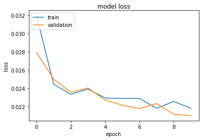
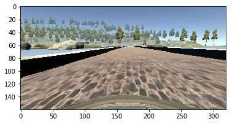
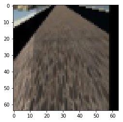

#**Behavioral Cloning Project**

The goals / steps of this project are the following:
* Use the simulator to collect data of good driving behavior
* Build, a convolution neural network in Keras that predicts steering angles from images
* Train and validate the model with a training and validation set
* Test that the model successfully drives around track one without leaving the road
* Summarize the results with a written report

## Rubric Points
###Are all required files submitted?

The submission includes a model.py file, drive.py, model.h5 and a writeup report. The code is readable and functional.

###Has an appropriate model architecture been employed for the task?
The following architecture is used:

Layer (type)          |Output Shape         |Param #
--- | --- | --- 
Lambda                |(None, 64, 64, 3)    |0           
Convolution2D         |(None, 64, 64, 3)    |12       
Activation            |(None, 64, 64, 3)    |0    
MaxPooling2D          |(None, 32, 32, 3)    |0
Convolution2D         |(None, 30, 30, 32)   |896 
Activation            |(None, 30, 30, 32)   |0
MaxPooling2D          |(None, 15, 15, 32)   |0
Dropout               |(None, 15, 15, 32)   |0
Convolution2D         |(None, 13, 13, 64)   |18496          
Activation            |(None, 13, 13, 64)   |0           
MaxPooling2D          |(None, 6, 6, 64)     |0
Dropout               |(None, 6, 6, 64)     |0           
Convolution2D         |(None, 4, 4, 128)    |73856                  
Activation            |(None, 4, 4, 128)    |0
MaxPooling2D          |(None, 2, 2, 128)    |0 
Dropout               |(None, 2, 2, 128)    |0 
Flatten               |(None, 512)          |0
Dense                 |(None, 512)          |262656                   
Dense                 |(None, 64)           |32832                   
Dense                 |(None, 16)           |1040                  
Dense                 |(None, 1)            |17            
Total params: 389,805|||

This network consists of one lambda-layer, 4 convolutional layers and 4 dense layers. 

Lambda layer is used to normalize the image data. The goal is to make initial weight values and image data the same scale.

First convolution layer is used to help the network to find the most suitable color scheme.

Next there are 3 convolution layer with increasing number of filters: 32, 64, 128. 

After it there are 3 dense layers with decreasing number of neurons: 512, 64, 16.

The final dense layer is used to merge all the results into one neuron (since it's a regression problem).

Every convolution layer is followed by elu activation and 2 * 2 maxpooling. 

Convolution layers 2-4 are followed by dropout. 

All the dense layers use elu activation, except the final which uses linear. I chose elu activation since it's smooth so since the backpropagation uses derivatives it should work better than relu. I also tried tanh but the results were worse.

### Has an attempt been made to reduce overfitting of the model?
As I mentioned before, I used 3 Dropout layers: after 2nd, 3rd and 4th convolution layers. I didn't add any dropout after Lambda layer and first convolution layer because they're not about feauture extraction, they're kind of image preprocessing. I tried adding dropout layers after the dense layers but I didn't see any efficiency increase after it. 

To detect the right number of epochs I divided my dataset into training and validation data as 80-20. I ended up with 10 epochs. As you can see on the chart below, it looks like the overfitting hasn't happened yet but the speed of MSE decrease is already close to 0. Of course, 10 epochs is just an approximation, it depends on the initial weights but usually it took me from 8 to 13 epochs to achieve the desired result. 

Also I believe that the used generator should help against the overfitting: all the elements are taken in random order and have random changes applied which means that every epoch training and validation datasets are different.

    

### Is the training data chosen appropriately?
The creation of the dataset is done in several steps.

1. Steering angle, left, right and center images are extracted from the .csv 

2. +0.22 to the steering angles for the left camera images, -0.22 to steering angles for right camera images. We couldn't calculate the correct angles since we didn't know the car size so I used the estimation made by one other students blogs (huge thanks to him). 

3. Flip all the images so the steering angle was positive and break them into the classes. Two images are in the same class if their rounded to the first significant digit values are equal. The thing is, first I started with a small dataset. And then I spent a lot of time trying to predict the angles based on the images from the center camera only. To achieve it, I came up with a generator which chose elements from the dataset by first choosing a class and then choosing an element from this class. Since the initial distribution wasn't uniform, I set class weights to influence on the probability of choosing images with high or low angles. E.g. when I set all the weights to be equal, the car was getting from side to side. When I set weights for 0.0 and 0.1 classes 3 times bigger than others, the car tended to prefer going straight. When I set the weights equal to the number of elements in classes, it almost never turned (since there are 50% images with angle ~0). Then I decided to manually check images in classes 0.6-1. The initial numbers of elements in these classes was low (e.g. there were only 2 images for 1.0) so it took about 40 minutes. I discovered that a lot of images (including the 1 of 2 images in 1.0 class) were incorrect. Obviously they appeared because the person who created the Udacity data tried to go from one side to another and back in order to create images with large steering angles and recorded not only paths from the road side but also the paths to the road side. Cleaning these images improved the network results. Then I thought that if even the person who tried to go from side to side managed to generate only 2 images with angle close to 1, then are they really this important? When I looked at the images I didn't see much difference between the images with 0.6 angle and images with 1.0 angle. I set 0 weight for the angles >0.6. It improved the performance again but not enough. Anyway, the number of images in these classes allowed to memorize them, not to generalize. When I moved to a large dataset (from all 3 cameras), I discovered that I don't need these little tricks any more, now it's enough data for the network to ignore the errors. However, I decided not to remove the classes because it's a convenient way of balancing data (if needed).  

4. The generator performes the preprocessing for the images. Every image is cropped (to remove everything above the horizon and the car itselfm first doesn't give much information, second creates unnecessary difference between the central and side camera images), flipped (with 50% chance), shifted, shadow added (with 50% chance), the brightness is changed (0.6 to 1.2 from the current level, the training set is made in a clear sunny weather so it made more sense to make the image darker) and it's resized to 64*64 (good choice according to http://cs231n.github.io/convolutional-networks/). Here is an example of image processing:

    

    

I used the default Adam optimizer. 

### Results.

The car moves smoothly on Track 1. It's preformance on Track 2 is also pretty good. I changed drive.py so when the car starts turning (|angle| > 0.2) it slows down. It's natural for humans and perfectly makes sense from math standpoint (since the car is turning, ideally we should change the angle continuously). Ideally to do decrease the speed smoother but this method was enough to get the results. The training uses ~20 000 images on each epoch, 10 epochs, ~30 minutes on CPU. 

One of the curious observations is that the most problematic situations for the car is when it's close to the left side of the road (which is the signal to go right) but it sees the left turn coming (which is the signal to go left).  This contradiction makes the car waving. The thing is, only the human needs to know that there is a turn somewhere in front of us. We need it because of the low speed of reaction, low ability to calculate the angles. But the car needs only the lanes right in front of it because while it's right between these lanes everything is fine. It's easy to notice that on the second track the car motion is smoother: I think it's because on this track it doesn't see that far. I tried to help the network by cropping the image so it doesn't see the turn in front of it until the very last moment but I didn't succeed: since I'm resizing the image to 64 * 64 (which is 5 times horizontally and 1.5 vertically) I need the lines to be as long as possible so that their angle left detectable on the resized image. But I'm still looking for the ways to solve it.

---
###Files Submitted

My project includes the following files:
* model.py containing the script to create and train the model
* drive.py for driving the car in autonomous mode
* model.h5 containing a trained convolution neural network 
* writeup_report.md or writeup_report.pdf summarizing the results
